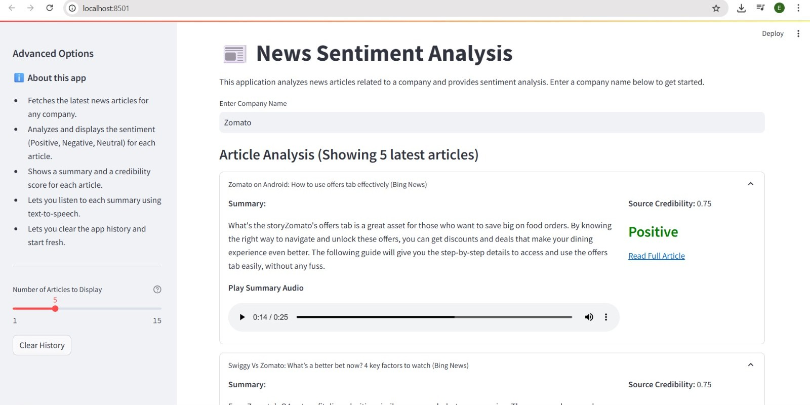

# News Sentiment Analysis Application

This web application fetches the latest news articles for a given company, analyzes their sentiment, provides a summary and credibility score for each article, and lets you listen to each summary using text-to-speech.

## Features

- Fetches the latest news articles for any company from Bing News
- Analyzes and displays the sentiment (Positive, Negative, Neutral) for each article
- Shows a summary and a credibility score for each article
- Lets you listen to each summary using text-to-speech (TTS)
- Lets you clear the app history and start fresh
- Clean, modern, and interactive web interface using Streamlit

## Requirements

- Python 3.7+
- Required packages (listed in requirements.txt)

## Installation

1. Clone this repository:
```bash
git clone https://github.com/Nikita-NA/News-sentiment-analysis.git
cd News-sentiment-analysis

```

2. Install the required packages:
```bash
pip install -r requirements.txt
```

## Usage

1. Run the Streamlit application:
```bash
streamlit run app.py
```

2. Open your web browser and navigate to the URL shown in the terminal (typically http://localhost:8501)

3. Enter a company name in the input field and press Enter

4. View the analysis results, including:
   - Article summaries
   - Sentiment and credibility for each article
   - Listen to each summary using the audio player
   - Use the "Clear History" button in the sidebar to reset the app

## App Screenshot

Here's a preview of the News Sentiment Analysis App:

### 🗺️ Example


## Output Format

The application provides:
- Title and summary for each article
- Sentiment classification (Positive, Negative, or Neutral)
- Source credibility score
- Audio playback of each summary (TTS)

## Note

- The application uses Bing News as the source for articles.
- Sentiment analysis is performed using the BERT model.
- Summaries are generated using the newspaper3k library.
- Text-to-speech is provided by gTTS. 